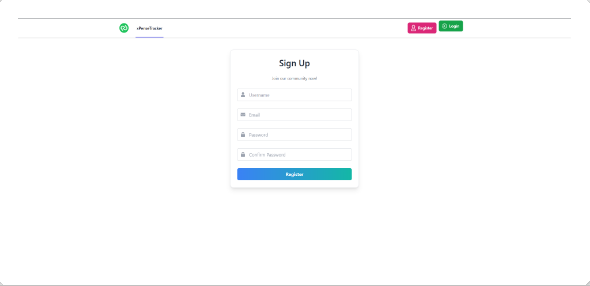
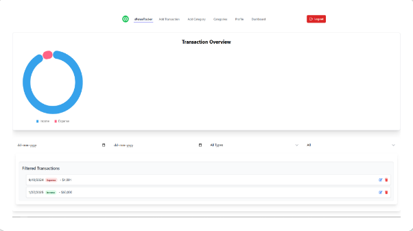
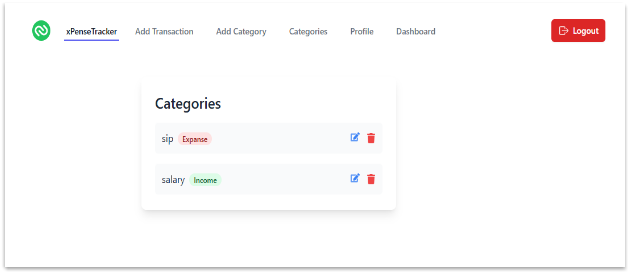

**FUNCTIONAL REQUIREMENTS SPECIFICATIONS**

**Product Name**:

` `xPenseTracker Web Application

Version: 1.0

Date: Jan 26, 2025

**Prepared By**:

` `Abhishek Yadav

Developer + QA

**Reviewed By**:

Abhishek Yadav

Developer + QA

**Approved By**:

Abhishek Yadav

Developer + QA

**Table of Contents**

|**Section** |**Page No.**|
| :- | :- |
|1. Introduction|**3**|
|1\.1 Purpose|**3**|
|1\.2 Scope|**3**|
|1\.3 Project Overview|**3**|
|
1\.4 Definitions, Acronyms, and Abbreviations

|**3**|
|2. Overall Description|**4**|
|2\.1 Product Perspective |**4**|
|2\.2 Product features |**4**|
|2\.3 User class and characteristics |**4**|
|2\.3 Operating Environment|**4**|
|3. Requirements |**4**|
|4. Functional Requirements|**5**|
|4\.1 User Registration and Login|**5**|
|4\.2 Home Page|**5**|
|4\.3 Add Transaction |**5**|
|4\.4 Add Category|**6**|
|4\.5 Category Section|**6**|
|4\.6 Profile |**6**|
|4\.7 Dashboard|**6**|
|4\.8 Public and Private Header|**7**|
|5. Non-functional Requirements|**7**|
|6. Assumptions and Constraints |**7**|
|7. Appendix |**7-13**|
|8. Sign-off |**14**|

1. Introduction
   1. **Purpose**

      The purpose of this document is to outline the functional requirements for the XPenseTracker Application.

      The FRS (Functional Requirements Specification) will guide the development and testing of the application to ensure it meets user need and project objectives

   1. **Scope**

      The Expense Tracker application allows users to register, log in, and manage personal financial transactions. It includes functionalities for adding transactions, categorizing expenses, viewing dashboards, and managing user profiles**.**

   1. **Project Overview**

      The XPenseTracker Application is designed to help users track and manage their financial transactions efficiently. It includes features such as user registration, transaction tracking, category management, and a dashboard for data visualization.

   1. **Definitions, Acronyms, and Abbreviations**
- **User:** Any individual interacting with the application.
- **Transaction Type:** Income, Expense, or Investment.

**2. Overall Description**

2\.1 **Product Perspective**
The **Expense Tracker** is a personal finance tool designed to help users track their income, expenses, and investments. The system will have user authentication features (registration and login), a dashboard with analytics, transaction tracking, category management, and user profile management.

2\.2 **Product Features**

- User registration and authentication.
- Transaction management (adding, editing, deleting).
- Category management (income, expense, investment).
- Dashboard with transaction overview and visual analytics.
- Profile management (username, password, email).

2\.3 **User Classes and Characteristics**

- **Registered Users:** Can add, view, and manage transactions, categories, and their profile.
- **Admin (if applicable):** Manages the system, user permissions, and app settings.

**2.4** **Operating Environment**
The application will run in modern web browsers (Chrome, Firefox, Safari, Edge) and be hosted online.

3\. Requirements 

- **Frontend**: React.js.
- **Backend**: Node.js, Express.js.
- **Database**: MongoDB.
- **Hosting**: Vercel.
- **Styling**: Tailwind CSS.

**4. Functional Requirements**

**4.1 User Registration and Login**

- **FR1:** The system should allow a user to register using an email and password.
- **FR2:** The system should authenticate users based on the email and password entered.
- **FR3:** If the user is not registered, they should be prompted to create an account.
- **FR4:** If the login fails, the user should see an error message.
- **General FRS:** Session Timeout

**4.2 Home Page**

- **FR5:** The system should display the home page with the following options on the navigation bar: **Add Transaction, Categories, Dashboard, Profile.**
- **FR6:** The home page should display a brief overview of recent transactions or financial summary.

**4.3 Add Transaction**

- **FR7:** Users can add a transaction with the following details:
  - **Transaction Type (Income, Expense, Investment)**
  - **Amount**
  - **Category** (from existing categories)
  - **Date**
  - **Description**
- **FR8:** A transaction can be saved in the system.
- **FR9:** The system should validate that all required fields are filled before submission.

**4.4 Add Category**

- **FR10:** Users can create a new category with the following options:
  - **Category Name**
  - **Category Type (Income, Expense, Investment)**
- **FR11:** Users can assign a name to the category and save it to the system.

**4.5 Categories Section**

- **FR12:** Users can view a list of all their categories.
- **FR13:** Users can update category names and types.
- **FR14:** Users can delete categories.

**4.6 Profile**

- **FR15:** Users can update their profile details, including:
  - **Username**
  - **Email**
  - **Password**
- **FR16:** The system should validate the updated email and password before saving.

**4.7 Dashboard**

- **FR17:** The dashboard should display an overview of the user's transactions with:
  - **Transaction Summary** (income, expense, and investment totals)
  - **Graphical representation** of transactions (e.g., pie chart or bar graph)
- **FR18:** The dashboard should allow users to filter transactions by date range (from-to) and transaction types (income, expense, investment).
- **FR19:** The system should provide visual analytics, such as a doughnut chart, to help users track spending patterns.

**4.8 Public and Private Header in Home Page**

- **FR20:** Public Navbar should** be visible only when user is not logged in.
- **FR21:** Private Navbar should only visible when user is logged in.

**5. Non-Functional Requirements**

**5.1 Performance Requirements**

- The application should be responsive and load within 2-3 seconds.

**5.2 Scalability**

- The system should support up to 100 concurrent users.

**5.3 Security**

- All user passwords should be stored securely using hashing and encryption methods.
- Only authorized users should have access to their profile data.

**5.4 Usability**

- The application should be intuitive and easy to navigate for end-users.

**5.5 Reliability**

- The system should ensure data integrity and avoid loss of user data

**6. Assumptions and Constraints**

- Users must have a valid email address to register.
- The application requires an internet connection for functionality.
- The application supports modern browsers (Chrome, Firefox, Edge).

7\. **Appendix**

**Application Screenshots**

1. **Homepage**: Homepage is arguably the very first page where user land after login or even after search from the Search Engines, in most cases this will be the first page that a customer will interacts However it needs to be clean and user friendly. Buttons will be well placed and easily accessible so that user will not get frustrated.

 

The header will be displayed at the top of the page, on every page not just the home page. Also, there are two Header one for customer who is not logged in the Application they see only Register and Login button and other one is for the logged customer. 

This feature will prevent the unauthorised access to header only logged customers can see the other navigation options 

The header has the following navigation options:

- xPenseTracker: Clicking this will direct the customer to the Home page. And clicking on get started will direct the customer to Signup page where customers can signup by fill the form .
- Add Transactions: Clicking this will direct the customer to Add Transactions page where use can Add Transactions, by selecting their preferred options given on the page and transaction are saved in the backed Database.
- Add Category: In Add Category user can add category by selecting options (Income, expanse, and investment) given on the page and Customer can give a unique name to it. Every category saved in the database.
- Categories: Customer or User can see their all Categories made by then here. 
- Profile: This is the main section here user or customer can change their username, email address and password. 
- Dashboard: In the Dashboard Navigation Customer can see their all activity in Doughnut chart also customer can use filter and search through date, transactions type and followed by categories.
- Logout: By clicking the logout button 

**7.2 User Registration Page**:

User Registration page is the critical feature it allows user to create account by filling a registration form customer need to enter details like.

- **Username**
- **Email**
- **Password**
- **Confirm** **password**

After filling out the form, user must click the Register button Upon successful registration, they will be able to log in and access additional features of the application.

**Login**: After completing the registration process, user need to log in the application to access the application features, 

The login process is simple and requires the following details: 

- **Username** (Valid and registered)
- **Password** (Valid and registered)

Upon successful login, users can perform various tasks, such as managing transactions and categories. The login process ensures that all user data, including transactions and categories, is securely saved in the database.

3. **Dashboard**:

The **Dashboard** is an important feature that shows users an overview of their activities. It displays graphs and charts to make data easier to understand. Users can:

- See their **transaction** history.
- Use filters (like date, **transaction** **type**, or **category**) to find specific data.
- Manage **transactions** and **categories** easily.

The dashboard helps users track and manage their financial activities

3. **Add Transaction**:
   The system shall provide a feature for users to add financial transactions.

   **Functionalities:**

1. Users shall select a **Transaction Type** (e.g., Income, Expense, Investment).
1. Users shall input the **Amount** for the transaction.
1. Users shall select a **Category** from the available list or add a new category.
1. Users shall choose the **Date** for the transaction.
1. Users may provide an optional **Description** for the transaction.
1. The transaction details shall be saved in the database.

3. **Categories Management**:

The system shall provide a feature for users to manage categories associated with their transactions.

**Functionalities:**

1. Users shall add new categories by selecting the **Category Type** (Income, Expense, Investment) and providing a **Category Name**.
1. Users shall edit existing categories to update the **Name** or **Type**.
1. Users shall delete categories they no longer need.
1. The category changes shall be saved and reflected throughout the system.

**8.Sign-Off**

This Functional Requirements Specification document has been prepared, reviewed, and approved by the undersigned. Any changes to the requirements will follow the change control process.

|**Role**|**Name**|**Date**|
| :- | :- | :- |
|Creator (Developer + Tester)|Abhishek |` `Jan26,2025|

-----
**Approval Statement**

*I, Abhishek, confirm that this Functional Requirements Specification accurately represents the scope and requirements of the project. All future changes or additions will be tracked and managed through a formal process.*

2

